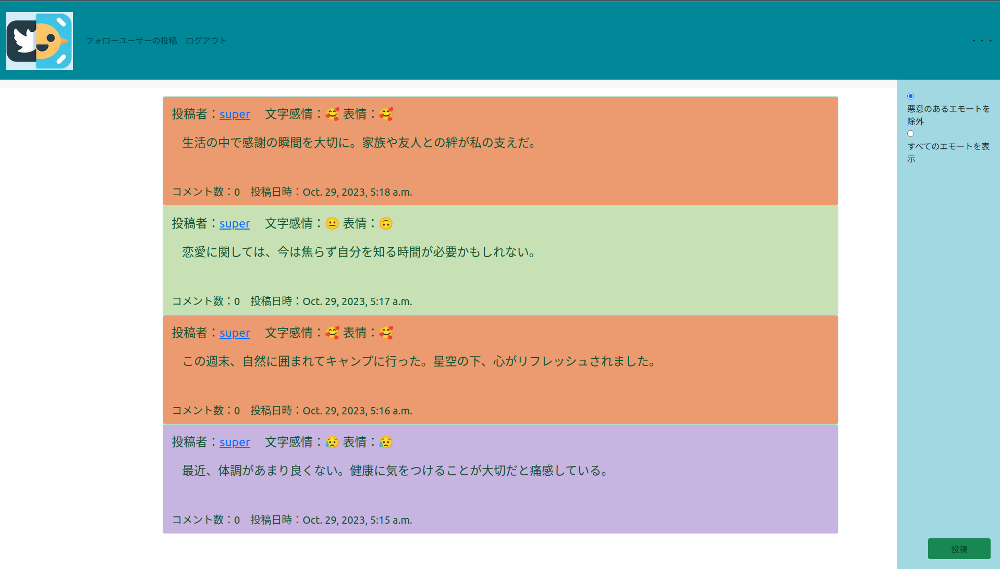
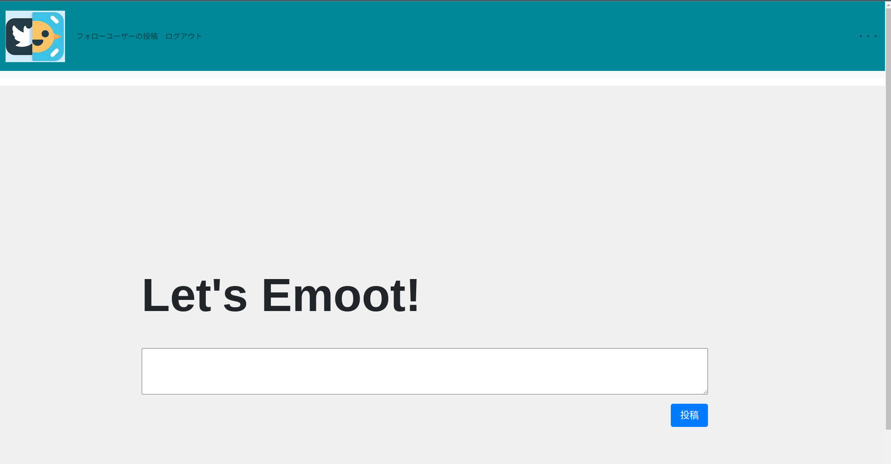

# Emotter(えもったー)

## 製品概要
### 背景 (製品開発のきっかけ、課題等)
友人が真顔で「ほんま草」とタイピングしX(旧Twitter)に投稿している場面を見てしまい、このままではいけないと感じたため。  
### 製品説明（具体的な製品の説明）
表情認識+自然言語感情認識を組み合わせた新感覚SNS。  
表情と文章から検出された感情が一致しないコメントを悪意のある投稿（≒嘘）と定義し、その一致頻度とタイムラインの掲載頻度を紐づけることで正直者が多いSNSを作ることができる。  

現行のバージョンでは、ネガポジの二値分類のみ対応している。  
- ネガティブ：😥
- ポジティブ： 🥰
- ニュートラル： 😐
- カメラ出力なし： 🙃

右のサイドバーのラジオボタンを切り替えることで、タイムライン上のエモート（投稿）についてフィルターをかけることができる。  

- [デモ動画](https://youtu.be/YF6t8Mepq1A)

- タイムライン

- エモート画面

### 特長
#### 1. 感情解析
- pythonの表情検出ライブラリであるFERと既存の学習済みモデルをファインチューニングしたモデルを用いた2種類の感情検出を使用  
#### 2. 一致検証
- プライバシーを尊重しながらエモートと感情検出結果を保存し、一致していない場合にはインプレッションが下がるように対応  
#### 3. ユーザー体験
- インターネットリテラシーの低い低学年や他のSNSでの喧騒に疲れたユーザーに向けてやさしいSNSを提供  

### 解決出来ること
- よい感情表現  
- 偽情報の軽減  
### 今後の展望
- ネガポジの二値分類から多クラス分類へ対応  
- 検出精度の向上  
- UIのさらなる改善  
- 画像を解析を用いて画像もエモートできるようにしたい
### 注力したこと（こだわり等）
* プライバシー保護のため画像をDBに保存せずに処理をすること  
* UIの部分について新感覚のSNS体験を提供できるように心がけた  
- インターフェースの配色についてはすべてエモい色で統一

## 開発技術
### 活用した技術
#### API・データ
* [日本語感情分類データセット@東北大学](https://github.com/ids-cv/wrime/)  
* [BERT日本語Pretrainedモデル](https://huggingface.co/docs/transformers/index)  

#### フレームワーク・ライブラリ・モジュール
* Django：SNSの作成  
* fer：画像処理  
* pytorch：自然言語処理  

#### デバイス
* PC(ブラウザはChromeを想定)  

### 独自技術
#### ハッカソンで開発した独自機能・技術
* SNS部分のUI
* BERTを東北大学の提供している日本語感情分類データセットでファインチューニング  
* プライバシー保護のために画像をデータURIに変換し感情抽出処理を行った部分に苦心した。  
[該当箇所](./snsapp/views.py#L202)  
